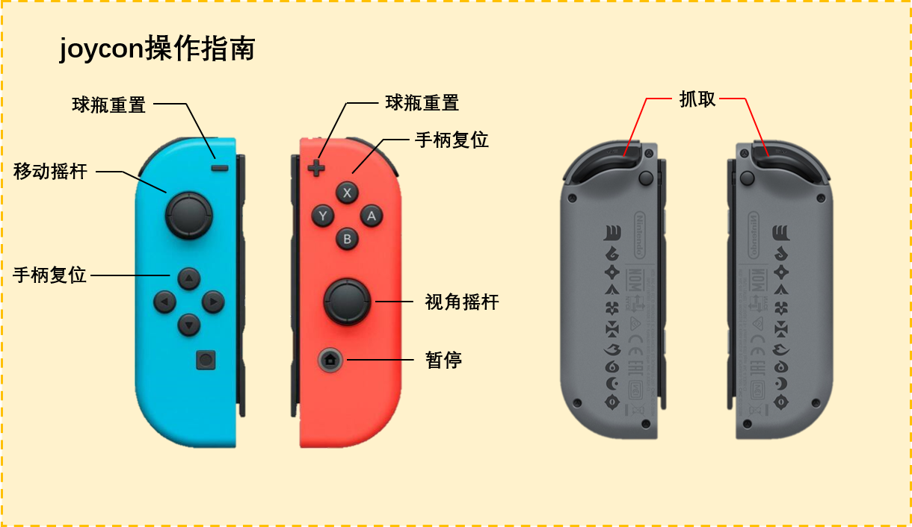

#    VR Project: Bowling
## 项目文件
由于 Github 的文件大小限制，如需完整项目文件，请下载 [Assets](https://pan.baidu.com/s/17MEWHvia5IrdAC4r10Bdhg?pwd=wj25)，解压为 `/Bowling/Assets/`。 
## 项目内容
### JoyCon

+ 考虑到完整 VR 设备的昂贵和小众，我们考虑使用更多家庭拥有的多功能游戏机 Nintendo Switch 附带的游戏手柄 JoyCon 作为默认操控设备。
+ 参考 [JoyConLib](https://github.com/Looking-Glass/JoyconLib)，我们完成了 JoyCon 的驱动。JoyCon 分为独立的左右两只。每只具有七个正面按键，一个摇杆，和两个肩键。此外，两只 JoyCon 还分别配备了陀螺仪和角加速度仪，可以记录角速度和角加速度。
+ 我们基于 XRSimulatedController，将 JoyCon 模拟为 XR 手柄，其中包括通过简单的卡尔曼滤波计算出朝向，并与 XR 手柄的朝向绑定。我们还优化了使用 JoyCon 控制视角和移动的功能，以便玩家在没有头显的情况下游玩。

### 3D Model

+ 通过模之屋可以下载游戏的人物模型。为了让游戏更有趣，我们用《崩坏：星穹铁道》中的角色布洛妮娅代替示例中的Kyle机器人，作为我们VR游戏的主角。模之屋的模型导入unity使用了MMD4工具辅助。此外，派蒙、帕姆、卡比也都是通过模之屋下载得到。
+ 简单斜坡模型通过3D Max制作，其他模型如屏幕、保龄球瓶等通过 https://www.turbosquid.com 下载得到。

### Gameplay（游戏逻辑）

+ **计分器**：通过脚本ScoreManager维护，当瓶子倾斜角度大于45°时记为被击倒，并且调用ScoreManager中的函数进行计分。计分结果会通过ScoreDisplay脚本实时显示在计分器上。
+ **球瓶复位**：通过Input Manager实现，接收到手柄的输入后，会发布Reset的broadcast信号，接受到信号的保龄球瓶会调用OnReset函数重置所有属性。
+ **保龄球回收**：通过物理设计斜坡和回收队列实现，保龄球投出后，利用强大的万有引力，会沿斜坡滚回指定位置。在到达斜坡底端后，会排队按一定间隔被送回球架。
+ **音效**：当球瓶发生碰撞时，如果相对速度较快，就会发出悦耳的响声。为了防止吵闹，球瓶倒下后不再会有响声。
+ **反馈**：我们利用joycon手柄的特性，让用户可以在游戏中收到体感反馈。在甩动手柄扔保龄球时，joycon手柄会发生与加速度关联的连贯震动。
+ **菜单**：本体通过Canvas的panel功能实现，调用通过Input Manager和canvas.enabled实现。调用菜单时会暂停时间，时停通过Time.scale实现。菜单栏目有三个选项，New Game会重新进入游戏，Resume会继续游戏，Quit则会退出游戏，这部分逻辑由Canvas的button组件实现。
+ **轨迹修正**：由于手柄的甩动幅度不稳定，初步接触游戏时保龄球很容易扔偏。我们对扔球时的逻辑进行改写，减小游戏难度：当球的速度的水平角在一定的范围内，即玩家向正常的方向扔出了球，就会缩小球z方向速度分量，修正出手轨迹。

### Scene（游戏场景）

+ **球馆**：我们尽可能按照保龄球馆搭建了一个室内场景，照明由天花板上四个点光源提供。
+ **赛道**：在游戏中设计了两条球道，二号赛道设置了加速属性，如果发生碰撞会对球进行加速，这部分逻辑通过检测碰撞以及addForce实现。为了让球能顺利沿着斜坡滚回，会额外对碰撞对象的x方向速度进行判断。
+ **第三人称视角**：现实中扔保龄球时，人不需要视觉，仅通过身体感知就可以很好控制手臂甩动，但是在VR中比较难做到。于是，我们用一个第三人称视角的相机记录，并且通过Render Texture投影到Canvas上，这样可以看到扔保龄球时手臂的状态，更方便用户调整手臂动作和姿态。
+ **场景bgm**：通过Audio source和music脚本实现。
+ **奇怪的球**：为了增加趣味性，我们提供了一些奇怪的球型物体，如精灵球和卡比。
+ **帕姆与派蒙**：游戏《原神》与《崩坏：星穹铁道》中主人公的同伴，放在场地中做装饰作用。但同时也是可交互物品，可以被抓取和投掷。

### 操作指南（额外操作）

+ **键鼠操作**：M键调用Menu，N键调用球瓶复位。

+ **Joycon操作**：如图。

  
